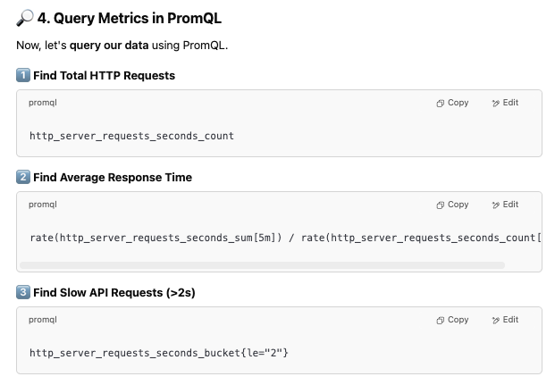
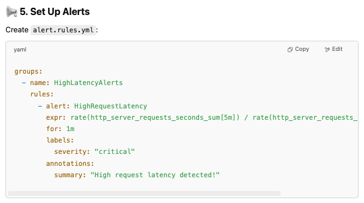
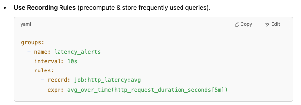

# Observability
### Sec01:
- open source monitoring and alerting system.
- Multidimensional data model with time series.
- static vs dynamic infrastructure
- Terminologies:
    - Monitoring: collect data from a process to validate if its behaving as expected.
    - Alert: 
        - prometheus to alertmanager(prometheus component)
    - Target: 
        - process of which metrics to be monitored.
        - instance: endpoint 
        - job: collection of target with same purpose.
- Architecture:
    - Prometheus server: 
        - retreival : retreive the metrics from instance targets jobs 
        - retreival stores data in a TSDB on the same node.
        - http server reads the data from the database and serves clients ( grafana)
        - jobs/exporter: prometheus target. ( retrival pulls data from jobs and exporters)
        - push gateway : short lived jobs(cron etc) scrap data and push the data to push gateway, retrival will pull the data from push gateway and then destroy the push gateway.
        - service discovery: vvi for dynamic infra - retrival uses service discovery to discover the target.(dynamic inventory of targets e.g k8s pods)
        - promQL: uses http backend, or we can use the http backend directly. 
        - visualization: Prometheus web UI, grafana
        - alertmanager: prometheus pushes alerts to alertmanager, then we need to configure pagerduty,email,slack in alertmanager to deliver the alerts.
- Arch 2
    - Prometheus server(main component, does the actual monitoring work, has 3 parts)
        - Scrapes metrics from your app’s /metrics endpoint.
        - storage, stores metrics data
        - retrival : pull metrics data
        - http server: accepts queries for stored data
    - Targets:
        - those things that prometheus monitors are called targets.
        - each target has 'units' of monitoring e.g current cpu status, memory usage, disk usage for linux server, or exception count for a application, something numeric. 
        - these metrics are stored in the database.
    - Metrics:
        - type + help attributes.
        - counters: only goes up, number of exceptions
        - gauge: can go up and down
        - histogram: how long the request took , how big the payload was
        - serires identifier
            - http_requests_total{job="nginx", instance:"10.1.2.3"}
            - http_requests_total = metric name
            - {job="nginx", instance:"10.1.2.3"} : labels
        - sample
            - (time1, value1) , (time2,value 2)
    - hostaddress/metrics : targets must expose this endpoint, data available in the endpoint must be in the format that prometheus understands.
    - exporter:
        - Used when an application does not expose Prometheus-compatible metrics.
        - fetches metrics from target, converts to correct format , expose hostaddress/metrics endpoint, suitable for monitroing external apps e.g linux server, database etc.
    - prometheus client libraries:
        - Monitoring your own app (OTEL might be better alternative)
    - pushgateway:
        - short lived targets push metrics to pushgateway on exit.
        - prometheus server pull data from push gateway
    - prometheus uses service discovery to find targets
    - rules:
        - aggregating metric values or creating alerts.
    - alertmanager:
        - server pushes to alertmanager.
    - promQL:
        - Prometheus web ui / grafana uses promQL to query data using prometheus http server.
    
- Arch limitations:
    - 

- Arch 3 (GPT)

- Spring app setup
    -   micrometer-registry-prometheus, spring-boot-starter-actuator
    - management.endpoints.web.exposure.include=*, management.metrics.export.prometheus.enabled=true
    - http://localhost:8080/actuator/metrics , http://localhost:8080/actuator/prometheus
    - 
        ```
            global:
        scrape_interval: 5s  # Collect metrics every 5 seconds

        scrape_configs:
        - job_name: 'spring-boot-app'
            metrics_path: '/actuator/prometheus'
            static_configs:
            - targets: ['host.docker.internal:8080']
        - job_name: 'react-app'
            static_configs:
            - targets: ['host.docker.internal:3000']
        ```
    - Add more custom metrics (@Timed, @Counted)
    - 
    - 
    - 